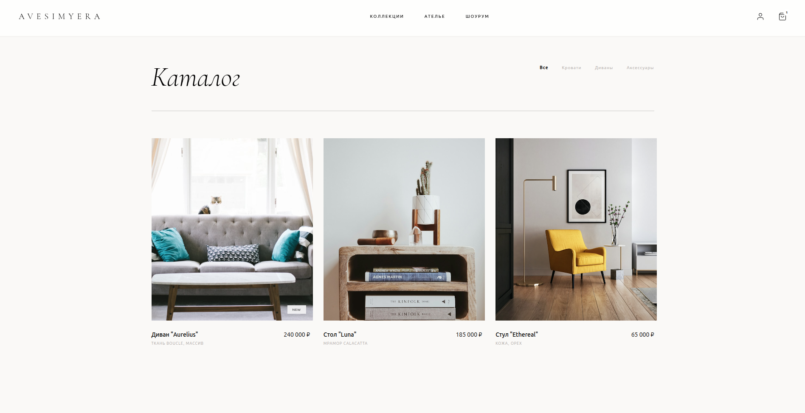
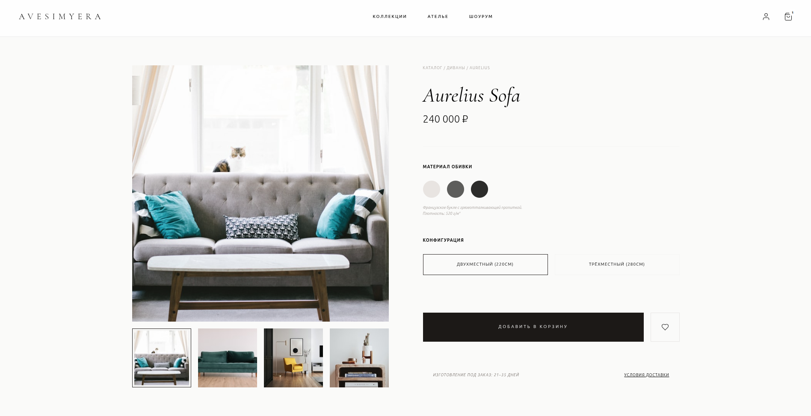
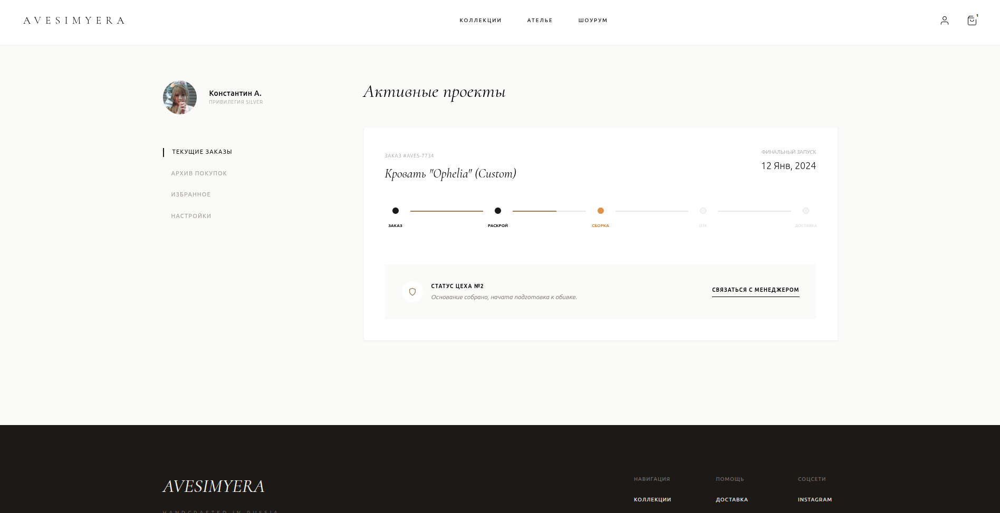

# Maison Art — Furniture E-commerce Store

Vite + Tailwind playground for a furniture catalog/showcase.

## Deployment

Production version: https://maisonart.vercel.app/

## Screenshots

Homepage:


Catalog:



Product Page:



Cart & Checkout:


Profile:



## Features

- **Homepage** - Hero section with brand introduction and collection showcases
- **Catalog** - Product grid with filtering options (All, Beds, Sofas, Accessories)
- **Product Page** - Detailed product view with image gallery, material selection, and configuration options
- **Shopping Cart** - Side panel cart with smooth slide-in animation
- **Checkout** - Order form with delivery options and payment summary
- **User Profile** - Account page with active orders tracking and progress visualization

## Tech Stack

- **Vite** - Build tool and dev server
- **Tailwind CSS** - Utility-first CSS framework
- **Vanilla JavaScript** - No framework, pure JS for interactivity
- **LocalStorage** - Cart persistence between pages


## Development

```bash
# Install dependencies
npm install

# Start dev server
npm run dev

# Build for production
npm run build

# Preview production build
npm run preview
```

## Customization

- Font: Cormorant Garamond (serif) for headings
- Color scheme: Stone/neutral palette with amber accents
- Animations: Custom slide-up and loading animations

